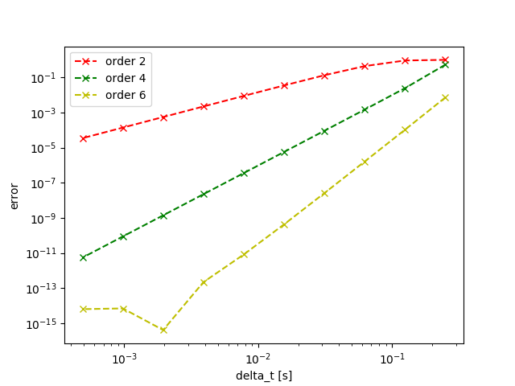
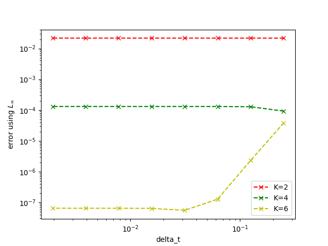

# Parallel Time Integration

These are implementations for the compact course "Introduction to parallel-in-time and other new time-stepping methods" at TUM.
These implementations may be incomplete or false.

### Dependencies

You need python3 and some libraries to run it. Anaconda should also work.
To install the libraries run

```
pip3 install numpy
pip3 install scipy
pip3 install matplotlib
```

## Implicit Runge-Kutta Time Integration

The implementation in RungeKutta.py is an implicit implementation where the Butcher
table is created by Gauss-Lobatto. To then calculate the Lagrange polynomials,
symbolic library "sympy" is used.

The relation between order and stages, using Gauss-Lobatto, is s = o+2 /2,
where s is the stages and o the order.

The remaining error using Runge-Kutta is dependent on the order and of quadratic
form. In log log space, the quadratic form is linear. For example, a second order remaining term
has a slope of 2. A plot of different order can be seen below.




## Parareal

Parareal is an algorithm for parallelizing time integration. Two grids are used,
a coarse one and a finer one, with two different integration schemes. In my
implementations I use the Runge-Kutta with different orders. More information
about parareal can be found [here](https://en.wikipedia.org/wiki/Parareal) and
[here](https://parallel-in-time.org/).

With higher iterations, K, the error gets reduced.



